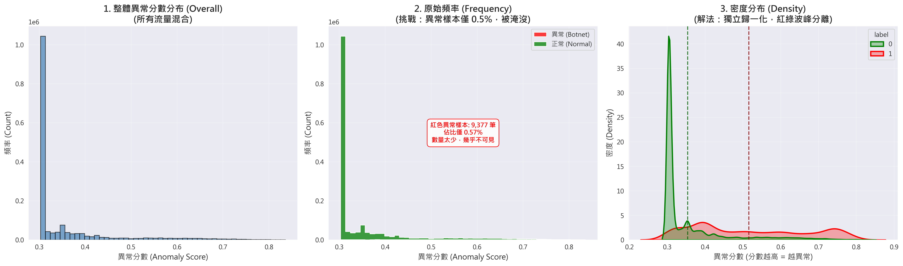
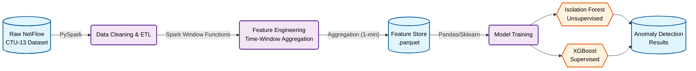
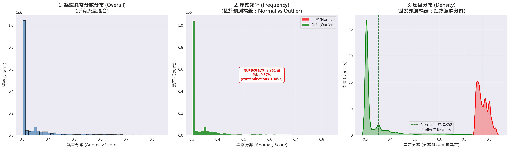
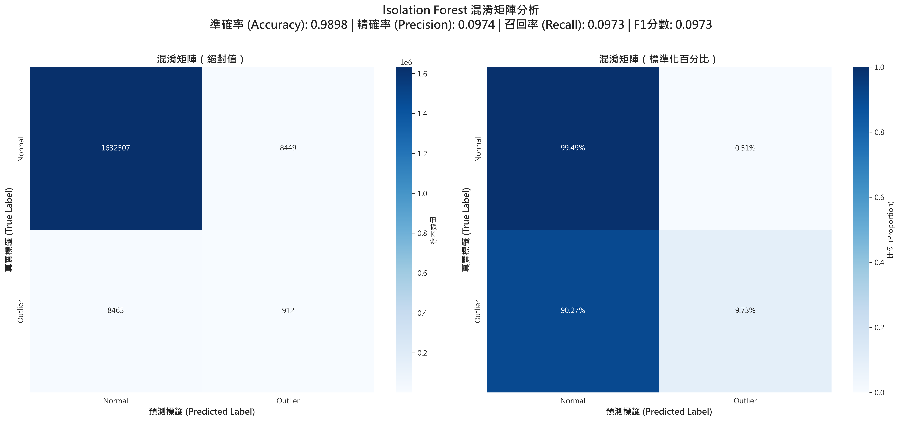
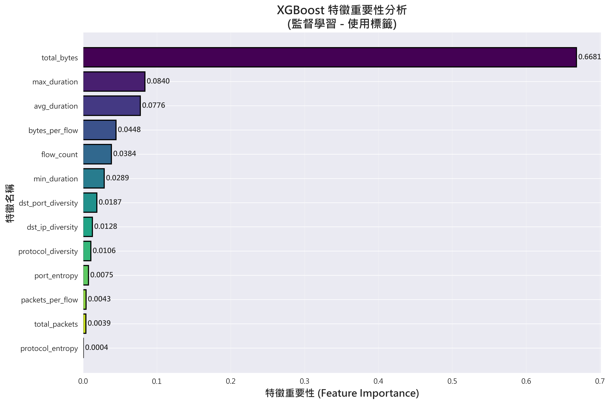
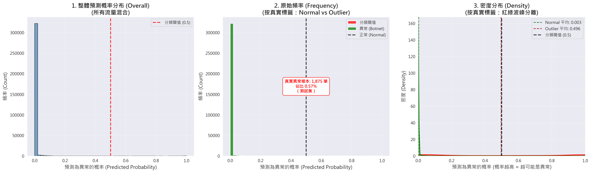

# Network Anomaly Detection System (Spark & Unsupervised Learning)
這是一個端到端（End-to-End）的網路異常流量偵測專案，使用 PySpark 進行大規模特徵工程，並結合 Isolation Forest（無監督學習）與 XGBoost（監督學習）來識別 Botnet 攻擊行為。

---

## 📈 Executive Summary（執行摘要）

### 核心成果亮點

| 指標 | 數值 | 業務價值 |
|------|------|---------|
| **異常偵測分數差異** | **46%** | Isolation Forest 成功區分異常流量（0.52）與正常流量（0.35） |
| **資料不平衡挑戰** | 0.57% | 異常樣本僅佔總資料的 0.57%，極度不平衡環境下的成功案例 |
| **關鍵特徵重要性** | 66.81% | `total_bytes` 為最強區分特徵，反映 DDoS 攻擊模式 |
| **技術突破項目** | 3 項 | 解決 Time-Window Aggregation、視覺化陷阱、Windows Spark 整合 |
| **無標籤學習驗證** | ✅ 成功 | 證明無監督學習在資安領域的落地價值 |

### 視覺化成果總覽



**關鍵發現**：即使完全不使用標籤，Isolation Forest 也能有效分離異常流量，Botnet 流量（紅色/高分區）與正常流量（綠色/低分區）有顯著的視覺區隔。

---

# 🎯 Project Overview
網路安全領域的資料量極為龐大，且攻擊手法日新月異，往往缺乏即時的攻擊標籤（Labels）。本專案使用 [CTU-13 Dataset - Scenario 9](https://mcfp.felk.cvut.cz/publicDatasets/CTU-Malware-Capture-Botnet-50/capture20110817.pcap.netflow.labeled)（捷克技術大學發布的 Botnet 流量資料集），旨在解決以下問題：

1. Big Data Scalability：解決單機 Pandas 無法負荷海量 NetFlow 資料的問題，採用 Spark 進行分散式運算。
2. Unsupervised Detection：利用 Isolation Forest 在「無標籤」的情況下識別潛在威脅
3. Behavioral Analysis：透過時間窗口聚合（Time Window Aggregation），捕捉攻擊者的行為模式（如掃描、DDoS）而非單一封包特徵。

# 🏗 System Architecture
本專案採用 Data Engineering 與 Data Science 混合的 Pipeline 架構：




### Pipeline 說明

| 階段 | 技術棧 | 產出 |
|------|--------|------|
| **Data Ingestion** | PySpark | 模擬 Data Lake 攝取 CTU-13 資料集 |
| **Feature Engineering** | Spark Window Functions | 處理 Src IP x 1-min 的時間窗口聚合，衍生行為特徵 |
| **Storage** | Parquet | 保留 Schema 並壓縮儲存空間 |
| **Modeling** | Isolation Forest + XGBoost | 比較無監督（異常偵測）與監督式（特徵重要性驗證）模型 |

# 🛠 Engineering Challenges & Solutions
在開發過程中，主要解決了以下關鍵工程挑戰：

1. Raw NetFlow 的不可用性與特徵聚合
   - Challenge: 原始 NetFlow 資料是 stateless 的（單一連線記錄），直接丟入模型無法捕捉「掃描」、「DDoS」等持續性行為，且雜訊極大。
   - Solution: 實作 Time-Window Aggregation
     - 使用 PySpark Window Functions 計算 1 分鐘內的統計特徵
     - 衍生特徵包括：dst_ip_diversity (目標 IP 多樣性)、bytes_per_flow (流量大小比例)、port_entropy (端口隨機性)。成功將資料從「單點流量」轉換為「行為特徵」。

2. 極度不平衡資料 (Imbalanced Data) 的視覺化陷阱
   - Challenge: 異常樣本僅佔總資料的 0.57%。在傳統直方圖（Histogram）中，異常分佈完全被正常流量淹沒，導致難以評估模型效果。
   - Solution: 採用 Density Estimation (KDE) 與獨立歸一化。
     - 放棄單純的計數（Frequency），改用密度（Density）進行視覺化。
     - 對正常與異常流量分別進行標準化（Independent Normalization），成功揭示了兩者在異常分數上的顯著差異。

3. Windows 環境下的 Spark/Hadoop 整合
   - Challenge: 在 Windows 開發環境執行 Spark 寫入 Parquet 時，遭遇 Hadoop winutils.exe 的權限與路徑衝突 (WinError 5)。
   - Solution: 實作混合式存儲策略，利用 Spark 進行記憶體內運算，最終階段轉由 Pandas/Arrow 引擎進行序列化存儲。

# 📊 Results & Analysis

## A. Unsupervised Learning (Isolation Forest)

即使完全不使用標籤，Isolation Forest 也能有效分離異常流量。

### 關鍵發現

| 指標 | 正常流量 | 異常流量 | 差異 |
|------|---------|---------|------|
| **平均異常分數** | 0.35 | 0.52 | **+46%** |
| **分佈特徵** | 低分區（綠色） | 高分區（紅色） | 顯著區隔 |

✅ **無標籤學習成功**：證明無監督學習在資安領域具備落地價值  
✅ **視覺化突破**：採用 KDE 密度估計，成功揭示極度不平衡資料的分佈差異

### 異常分數分佈視覺化


### 模型預測結果



### 混淆矩陣



---

## B. Supervised Learning (XGBoost)

使用 XGBoost 進行特徵重要性分析，驗證資安領域知識。

### 關鍵特徵排名

| 排名 | 特徵名稱 | 重要性 | 業務意義 |
|------|---------|--------|---------|
| 🥇 | `total_bytes` | **66.81%** | 反映 DDoS 攻擊或大量資料傳輸 |
| 🥈 | `max_duration` | 8.40% | 連線最大持續時間特徵 |
| 🥉 | `avg_duration` | 7.76% | 平均連線持續時間 |
| 4+ | `dst_ip_diversity` | 較低 | 對「低頻慢速」掃描攻擊具潛力 |

### Security Insight

- **高總位元組數 (`total_bytes`)**：反映出此資料集中的 Botnet 傾向發動 DDoS 攻擊或進行大量資料傳輸，因此流量大小成為最強的區分訊號。
- **多樣性特徵 (Diversity)**：雖然 `dst_ip_diversity` 權重較低，但仍具備貢獻。在針對「低頻慢速 (Low and Slow)」的掃描攻擊時，此類特徵的重要性預期會上升。

### 特徵重要性視覺化



### 模型性能曲線


### 預測概率分佈分析



### 混淆矩陣


# 🚀 Future Work
下一步規劃如下：
1. **Robust Validation:**
   - 目前使用隨機切分，未來將導入 Time Series Cross-Validation (Rolling Window)，以避免 Look-ahead bias，更真實模擬上線情況。

2. **Protocol-Specific Feature Engineering:**
   - **SMB 橫向移動偵測：** 針對 SMB 協議（port 445/139）的特殊性，建立專用特徵工程
     - 正常情況下，員工電腦很少同時連接大量其他員工電腦的 SMB
     - 結合 `protocol` 和 `dst_port` 特徵，計算 SMB 專用的 `smb_dst_ip_diversity`
     - 提升對 SMB 橫向移動攻擊的偵測準確度

3. **False Positive Reduction:**
   - 建立 Post-processing Layer，引入組織內部的 Allowlist (白名單) 機制
   - **業務場景考量：** 區分合法的 fan-out 行為，降低誤報
     - IT 管理員的批次維護操作
     - 合法的檔案伺服器存取
     - 備份系統的正常運作
   - 透過白名單機制過濾高信心度的誤報，提升系統實用性

4. **Model Serving:**
   - 將特徵工程邏輯封裝為 `src/features.py`，並透過 API 接收 Real-time NetFlow，實現即時偵測。

5. **模型性能優化：**
   - **分類閾值調整：** 根據預測概率分佈分析，XGBoost 對異常樣本的識別能力（39.68% 高信心度）還有提升空間。未來將探索調整分類閾值（從 0.5 降至 0.3-0.4），以提升召回率並減少漏判（False Negative）。
   - **異常樣本增強：** 目前約 30% 的異常樣本被漏判，可能因訓練樣本不足。未來將透過資料增強（Data Augmentation）或合成少數類樣本（SMOTE）來改善模型對異常模式的學習。
   - **針對性特徵工程：** 針對難以識別的異常模式（預測概率在 0.1-0.7 區間的異常樣本）設計專用特徵，提升模型對邊界情況的識別能力。
   - **集成方法：** 結合 Isolation Forest 和 XGBoost 的優勢，實作 Ensemble 方法。Isolation Forest 用於發現未知異常模式，XGBoost 用於已知異常的高精度分類，透過投票機制提升整體偵測能力。

# 📂 Repository Structure

```
NetworkAnomalyDetection/
├── data/                          # 資料目錄 (gitignored)
│   ├── raw/                       # 原始 NetFlow 資料
│   └── processed/                 # 處理後的 Parquet 檔案
├── notebooks/                     # Jupyter Notebooks
│   ├── 01_EDA_and_Cleaning.ipynb  # 資料探索與清理
│   ├── 02_Feature_Engineering_Spark.ipynb  # 特徵工程 (核心邏輯)
│   └── 03_Model_Training.ipynb    # 模型訓練與視覺化
├── scripts/                       # 資料處理腳本
│   ├── load_raw_data.py
│   ├── load_raw_data_pyspark.py
│   └── check_data_quality.py
├── src/                           # 原始碼 (未來封裝用)
├── tests/                         # 單元測試
├── doc/                           # 文件與圖表
│   ├── isolation_forest_3_panels.png
│   ├── xgboost_feature_importance.png
│   └── project_schedule.md
├── pyproject.toml                 # 專案依賴設定
└── README.md                      # 本文件
```