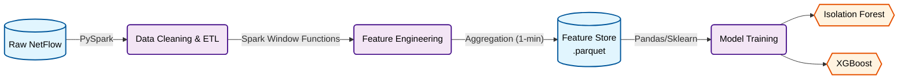

# Network Anomaly Detection System (Spark & Unsupervised Learning)
這是一個端到端（End-to-End）的網路異常流量偵測專案，使用 PySpark 進行大規模特徵工程，並結合 Isolation Forest（無監督學習）與 XGBoost（監督學習）來識別 Botnet 攻擊行為。

# 🎯 Project Overview
網路安全領域的資料量極為龐大，且攻擊手法日新月異，往往缺乏即時的攻擊標籤（Labels）。本專案使用 [CTU-13 Dataset - Scenario 9](https://mcfp.felk.cvut.cz/publicDatasets/CTU-Malware-Capture-Botnet-50/capture20110817.pcap.netflow.labeled)（捷克技術大學發布的 Botnet 流量資料集），旨在解決以下問題：

1. Big Data Scalability：解決單機 Pandas 無法負荷海量 NetFlow 資料的問題，採用 Spark 進行分散式運算。
2. Unsupervised Detection：利用 Isolation Forest 在「無標籤」的情況下識別潛在威脅
3. Behavioral Analysis：透過時間窗口聚合（Time Window Aggregation），捕捉攻擊者的行為模式（如掃描、DDoS）而非單一封包特徵。

# 🏗 System Architecture
本專案採用 Data Engineering 與 Data Science 混合的 Pipeline 架構：

程式碼片段


- Data Ingestion: 模擬 Data Lake 攝取 CTU-13 資料集。
- Feature Engineering (Spark): 處理 Src IP x 1-min 的時間窗口聚合。
- Storage: 使用 Parquet 格式儲存，保留 Schema 並壓縮儲存空間。
- Modeling: 比較無監督（異常偵測）與監督式（特徵重要性驗證）模型。

# 🛠 Engineering Challenges & Solutions
在開發過程中，主要解決了以下關鍵工程挑戰：

1. Raw NetFlow 的不可用性與特徵聚合
   - Challenge: 原始 NetFlow 資料是 stateless 的（單一連線記錄），直接丟入模型無法捕捉「掃描」、「DDoS」等持續性行為，且雜訊極大。
   - Solution: 實作 Time-Window Aggregation
     - 使用 PySpark Window Functions 計算 1 分鐘內的統計特徵
     - 衍生特徵包括：dst_ip_diversity (目標 IP 多樣性)、bytes_per_flow (流量大小比例)、port_entropy (端口隨機性)。成功將資料從「單點流量」轉換為「行為特徵」。

2. 極度不平衡資料 (Imbalanced Data) 的視覺化陷阱
   - Challenge: 異常樣本僅佔總資料的 0.57%。在傳統直方圖（Histogram）中，異常分佈完全被正常流量淹沒，導致難以評估模型效果。
   - Solution: 採用 Density Estimation (KDE) 與獨立歸一化。
     - 放棄單純的計數（Frequency），改用密度（Density）進行視覺化。
     - 對正常與異常流量分別進行標準化（Independent Normalization），成功揭示了兩者在異常分數上的顯著差異。

3. Windows 環境下的 Spark/Hadoop 整合
   - Challenge: 在 Windows 開發環境執行 Spark 寫入 Parquet 時，遭遇 Hadoop winutils.exe 的權限與路徑衝突 (WinError 5)。
   - Solution: 實作混合式存儲策略，利用 Spark 進行記憶體內運算，最終階段轉由 Pandas/Arrow 引擎進行序列化存儲。

# 📊 Results & Analysis
A. Unsupervised Learning (Isolation Forest)
即使完全不使用標籤，Isolation Forest 也能有效分離異常流量。

- 下圖顯示 Anomaly Score Distribution。
- 可以看到 Botnet 流量（紅色/高分區，平均分數 0.52）與正常流量（綠色/低分區，平均分數 0.35）有顯著的區隔，分數差異達 46%。
- 數據驗證：異常流量平均分數 (0.52) 顯著高於正常流量 (0.35)。這證明無監督學習具備落地價值。


B. Feature Importance (XGBoost)
使用 XGBoost 進行特徵重要性分析，以驗證資安領域知識。

- **關鍵特徵：** 模型顯示 `total_bytes` (總位元組數，重要性 0.6681)、`max_duration` (最大持續時間，0.0840) 和 `avg_duration` (平均持續時間，0.0776) 是區分 Botnet 的關鍵特徵。

- **Security Insight**: 
  - 高總位元組數 (`total_bytes`)：反映出此資料集中的 Botnet 傾向發動 DDoS 攻擊 或進行 大量資料傳輸，因此流量大小成為最強的區分訊號。
  - 多樣性特徵 (Diversity)：雖然 `dst_ip_diversity` 權重較低，但仍具備貢獻。在針對「低頻慢速 (Low and Slow)」的掃描攻擊時，此類特徵的重要性預期會上升。


# 🚀 Future Work
為了將此 POC 轉化為生產級系統，下一步規劃如下：

1. Robust Validation:
   - 目前使用隨機切分，未來將導入 Time Series Cross-Validation (Rolling Window)，以避免 Look-ahead bias，更真實模擬上線情況。
2. False Positive Reduction:
    - 建立 Post-processing Layer，引入組織內部的 Allowlist (白名單) 機制（如 DNS Server、CDN IP），過濾高信心度的誤報。
3. Model Serving:
   - 將特徵工程邏輯封裝為 `src/features.py`，並透過 API 接收 Real-time NetFlow，實現即時偵測。

# 📂 Repository Structure

```
NetworkAnomalyDetection/
├── data/                          # 資料目錄 (gitignored)
│   ├── raw/                       # 原始 NetFlow 資料
│   └── processed/                 # 處理後的 Parquet 檔案
├── notebooks/                     # Jupyter Notebooks
│   ├── 01_EDA_and_Cleaning.ipynb  # 資料探索與清理
│   ├── 02_Feature_Engineering_Spark.ipynb  # 特徵工程 (核心邏輯)
│   └── 03_Model_Training.ipynb    # 模型訓練與視覺化
├── scripts/                       # 資料處理腳本
│   ├── load_raw_data.py
│   ├── load_raw_data_pyspark.py
│   └── check_data_quality.py
├── src/                           # 原始碼 (未來封裝用)
├── tests/                         # 單元測試
├── doc/                           # 文件與圖表
│   ├── isolation_forest_3_panels.png
│   ├── xgboost_feature_importance.png
│   └── project_schedule.md
├── pyproject.toml                 # 專案依賴設定
└── README.md                      # 本文件
```