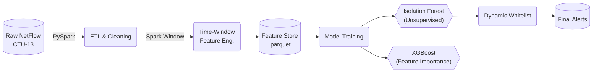
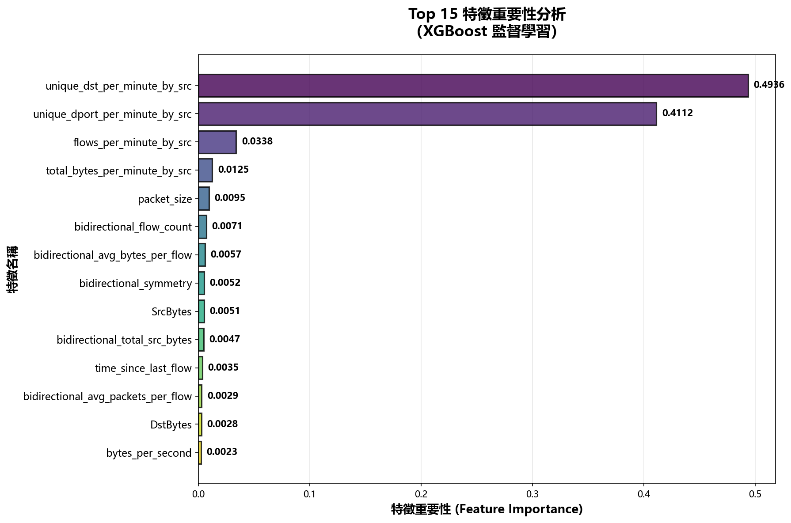
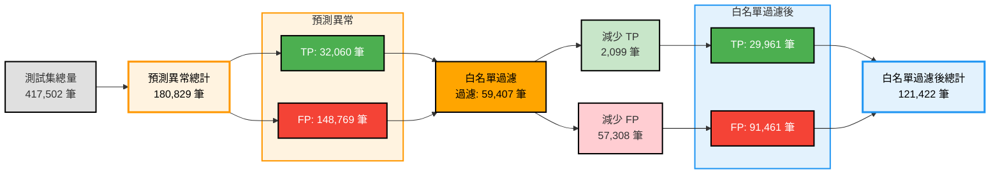

# Network Anomaly Detection System (Spark & Unsupervised Learning)
這是一個基於 非監督式學習 (Unsupervised Learning) 的網路異常偵測系統，專為處理缺乏標籤的資安流量數據設計。針對 CTU-13 Botnet 資料集，本專案採用 Hybrid Detection Architecture (混合偵測架構)，結合 Isolation Forest 模型與動態白名單機制，目標是解決傳統非監督式模型高誤報率 (Alert Fatigue) 的痛點。

---

## 📈 Executive Summary（執行摘要）

本專案在極度不平衡（異常比例僅 8.86%）的資料集上，驗證了無監督學習於資安領域的落地可行性。

| 指標 | 數值 | 業務價值 |
|------|------|---------|
| **False Positive 降低** | **📉 -38.5%** | 透過漏斗式過濾架構，成功消除 5.7 萬筆無效警報，大幅降低維運人員負擔。 |
| **最終準確率** | **76.41%** | 在 10:1 的不平衡資料環境下，應用白名單後處理後的整體表現。 |
| **召回率 (Recall)** | **80.98%** | 確保絕大多數潛在威脅不被遺漏 |
| **關鍵特徵** | 90.48% | 證明 **時間窗口聚合 (Time-Window Aggregation) **的行為特徵（如一分鐘內連線不同 IP 數）遠比單一封包特徵有效。 |

---

# 🎯 Project Overview
網路安全領域面臨海量數據且缺乏即時標籤（Labels）的挑戰。本專案使用 [CTU-13 Dataset - Scenario 9](https://mcfp.felk.cvut.cz/publicDatasets/CTU-Malware-Capture-Botnet-50/detailed-bidirectional-flow-labels/)（捷克技術大學發布的 Botnet 流量資料集），旨在解決以下問題：

1. **Unsupervised Detection**：利用 Isolation Forest 在「無標籤」的情況下識別潛在威脅
2. **Alert Fatigue Reduction**: 透過「漏斗式過濾」架構與動態白名單，降低誤報。
3. **Behavioral Analysis**：利用 PySpark Window Functions 實作時間窗口聚合，捕捉「掃描」與「DDoS」等持續性行為模式。

# 🏗 System Architecture
本專案採用 End-to-End 的資料處理 Pipeline，整合大數據處理與機器學習技術。

## Technical Pipeline



- **分散式資料處理**：PySpark 進行大規模 NetFlow 資料攝取與清洗
- **時間窗口聚合**：Spark Window Functions 衍生行為特徵（1 分鐘窗口）
- **機器學習**：Isolation Forest（無監督）與 XGBoost（監督）雙模型架構
- **誤報降低**：動態白名單機制進行後處理優化


### Pipeline 說明

| 階段 | 技術棧 |  說明 |
|------|--------|------|
| **Data Ingestion** | PySpark |  模擬 Data Lake 架構，處理大規模 Binetflow 數據。 |
| **Feature Engineering** | Pandas/Spark Window Functions | **Time-Window Aggregation**：計算 1 分鐘內的行為特徵（如 IP 多樣性、Port 熵值）。 |
| **Feature Transformation** | Log1p + RobustScaler |  **Log1p + RobustScaler**：解決 NetFlow 數據嚴重的長尾分佈 (Power-law) 問題。 |
| **Modeling** | Isolation Forest + XGBoost | 無監督（異常偵測）與監督式（特徵重要性驗證）模型 |
| **Post-processing** | Python |  **False Positive Reduction**：分析誤報模式，基於誤報模式分析生成的動態白名單。 |







# 🏛 Design Patterns

為了確保系統的可維護性與擴展性（Extensibility），本專案採用多種設計模式以提升可維護性與擴展性，確保程式碼品質與架構清晰度。

## 設計模式導覽

| 設計模式 | 應用位置 | 用途 | 文檔連結 |
|---------|---------|------|---------|
| **Factory Pattern** | `ModelFactory`, `DataLoaderFactory` | 統一創建模型與資料載入器 | [詳細說明](docs/DESIGN_PATTERNS.md#factory-pattern) |
| **Strategy Pattern** | `FeatureSelector` | 多種特徵選擇策略 | [詳細說明](docs/DESIGN_PATTERNS.md#strategy-pattern) |
| **Abstract Base Class** | `BaseModel`, `BaseDataLoader`, `BaseFeatureProcessor` | 統一介面定義 | [詳細說明](docs/DESIGN_PATTERNS.md#abstract-base-class-pattern) |

## 設計模式應用

### 🏭 Factory Pattern

1. Factory Pattern (工廠模式)
   - 應用： `src/models.py`, `src/data_loader.py`
   - 目的： 解耦模型的創建與使用。
   - 效益： 若未來要將 Isolation Forest 替換為 Autoencoder，或將資料源從 CSV 改為 Kafka，只需新增一個 Class 並註冊，完全不影響主程式邏輯。

2. Strategy Pattern (策略模式)
   - 應用： `src/feature_selector.py`
   - 目的： 動態切換特徵選擇演算法。
   - 效益： 支援在 Runtime 選擇「相關性過濾」、「變異數過濾」或「XGBoost 重要性過濾」，便於進行 A/B Testing 實驗。

3. Interface Segregation (介面隔離)
   - 應用： BaseModel, BaseDataLoader (Abstract Base Classes)
   - 效益： 定義清晰的 train(), predict(), clean() 介面，確保團隊開發的規範性。

---

## 📚 詳細文檔

- **[系統架構總覽](docs/ARCHITECTURE.md)** - 完整的系統架構與設計模式應用位置
- **[設計模式總覽](docs/DESIGN_PATTERNS.md)** - 詳細的設計模式說明與使用指南

# 🛠 Engineering Challenges & Solutions
在開發過程中，解決了以下關鍵挑戰：

1. Raw NetFlow 的 Stateless 特性
   - **挑戰**： 原始 NetFlow 只是單條連線記錄，無法識別「掃描」或「DDoS」等跨時間行為。
   - **解法**： 實作 Time-Window Aggregation。利用 PySpark Window Functions 計算 `SrcIP` 在 1 分鐘內的統計特徵（如 `unique_dst_count`）。這將資料從「單點流量」提升為「行為特徵」，XGBoost 重要性顯示這些特徵佔據了 90% 的貢獻度。

2. 極度不平衡資料 (Imbalanced Data)
   - **挑戰**： 異常樣本僅佔 8.86%，在傳統視覺化中完全被淹沒。
   - **解法**： 放棄 Frequency 直方圖，改用 Density Estimation (KDE) 並對正常/異常流量進行獨立歸一化，成功揭示了兩者在異常分數上的顯著差異。

3. Windows 環境下的 Spark 整合
   - 挑戰： 在 Windows 開發環境遭遇 Hadoop `winutils.exe` 權限問題。
   - 解法： 實作混合式策略與自動記憶體配置。利用 `psutil` 動態調整 Spark Executor 記憶體，並在寫入階段切換至 Pandas/Arrow 引擎以規避 Hadoop 依賴，確保開發環境與生產環境的兼容性。

# 📊 Results & Analysis

## **白名單降噪效果 (Funnel Filtering)**
應用動態白名單後，我們在測試集上取得了顯著的性能提升：

| 指標 | 原始模型 (Raw) | 白名單後處理 (Post-processed) | 差異 (Delta) |
|---------|------|------|------|
| **False Positives** | 148,769 | 91,461 | 📉 -38.5% |
| **Precision** | 17.73% | 24.68% | 🚀 +6.95% |
| **Recall** | 86.66% | 80.98% | ⚠️ -5.68% |
| **F1-Score** | 29.44% | 37.83% | 📈 +8.39% |

分析： 雖然 Recall 微幅下降，但這是為了大幅降低 Alert Fatigue 的策略性權衡。被濾除的 False Negatives 主要為極短時間的 UDP 封包，這屬於 NetFlow L4 層級的極限，未來可透過 DPI (Deep Packet Inspection) 進一步優化。


# 🚀 快速開始

1. 安裝依賴
```Bash
pip install -r requirements.txt
```
2. 執行完整 Pipeline
自動執行 ETL、特徵工程、模型訓練與白名單後處理：
```Bash
python main.py --pipeline full
```
3. 生成分析報告
將生成包含所有視覺化圖表的 HTML 報告：

```Bash
python scripts/generate_report.py

# 報告位置: output/report/report.html
```
---


# 📂 Project Structure

```
NetworkAnomalyDetection/
├── data/                          # 資料目錄 (gitignored)
│   ├── raw/                       # 原始 NetFlow 資料
│   ├── processed/                 # 處理後的 Parquet 檔案
│   └── models/                    # 訓練好的模型與配置
│       ├── unsupervised_training/ # 無監督學習訓練結果
│       └── whitelist_rules/      # 白名單規則
├── notebooks/                     # Jupyter Notebooks
│   ├── bidirectional/             # 雙向流分析
│   └── EDA_and_Feature.ipynb      # 資料探索與特徵分析
├── scripts/                       # 執行腳本
│   ├── evaluation/                # 評估腳本
│   │   ├── check_supervised_overfitting.py
│   │   └── compare_feature_transformations.py
│   ├── unsupervised_model_selection/  # 無監督模型選擇（快速評估與比較）
│   │   ├── quick_model_benchmark.py
│   │   └── compare_model_results.py
│   ├── generate_report.py         # 統一的 HTML 報告生成器
│   ├── load_data_first_time.py    # 首次資料載入
│   ├── postprocess_with_whitelist.py  # 白名單後處理
│   ├── train_supervised.py        # 監督學習訓練
│   └── train_unsupervised.py     # 無監督學習訓練
├── src/                           # 核心模組（設計模式實作）
│   ├── models.py                  # Factory Pattern: ModelFactory
│   ├── data_loader.py             # Factory Pattern: DataLoaderFactory
│   ├── feature_selector.py        # Strategy Pattern: FeatureSelector
│   ├── feature_processor.py       # Abstract Base Class: BaseFeatureProcessor
│   ├── feature_engineer.py        # 特徵工程核心邏輯
│   ├── feature_transformer.py     # 特徵轉換（對數、Box-Cox 等）
│   ├── label_processor.py         # 標籤處理與轉換
│   ├── training_utils.py          # 訓練工具函數
│   ├── whitelist.py               # 白名單分析與應用
│   ├── evaluator.py               # 評估指標計算
│   └── features.py                # 特徵提取（用於即時偵測）
├── tests/                         # 單元測試
│   ├── test_data_loader.py
│   ├── test_feature_transformer.py
│   └── test_label_processor.py
├── docs/                          # 📚 統一文檔目錄
│   ├── ARCHITECTURE.md            # 系統架構總覽（設計模式應用位置）
│   ├── DESIGN_PATTERNS.md         # 設計模式總覽
│   ├── README_REPORT.md            # 報告生成器使用說明
│   ├── ISOLATION_FOREST_IMPROVEMENT_PLAN.md  # Isolation Forest 改進計劃
│   └── XGBOOST_OVERFITTING_CHECK.md  # XGBoost 過擬合檢查
├── output/                        # 輸出目錄
│   ├── report/                    # HTML 報告
│   ├── visualizations/            # 視覺化圖表
│   ├── evaluations/               # 評估結果
│   └── unsupervised_model_selection/  # 模型選擇結果
├── main.py                        # 主程式入口（統一執行介面）
├── pyproject.toml                 # 專案依賴設定（Poetry/Pip）
├── requirements.txt               # 依賴清單（備用）
└── README.md                      # 本文件
```

# 🚀 Future Work & Roadmap

本專案目前定位為 **MVP (Minimum Viable Product)**，驗證了無監督學習在 Botnet 偵測的可行性。針對 Production Ready 的目標，規劃了以下演進路線：

### 1. 深度封包檢測 (Deep Packet Inspection, DPI) integration
* **痛點：** 目前的 NetFlow (Layer 4) 特徵無法有效區分「正常 DNS 查詢」與「偽裝成 DNS 的 C&C 通訊」（兩者流量特徵極為相似，導致 False Negatives）。
* **計畫：** 下一階段將引入 **Zeek (Bro)** 或 **Suricata** 解析 L7 Payload，提取 DNS Query String 的熵值 (Entropy) 與域名特徵，以解決 UDP/53 偽裝攻擊的盲點。

### 2. 從 Batch 到 Streaming (Real-time Detection)
* **痛點：** 目前採用 T+1 的批次處理模式，無法即時阻斷攻擊。
* **計畫：**
    * 將 Pandas/Sklearn 的特徵工程邏輯遷移至 **Spark Structured Streaming**。
    * 實作 **Online Learning** 機制（如使用 River 套件），讓 Isolation Forest 能適應概念漂移 (Concept Drift)，無需每天重新訓練。

### 3. Human-in-the-loop (主動式回饋循環)
* **痛點：** 白名單目前是靜態規則，缺乏維運人員的動態反饋。
* **計畫：** 建立 **Feedback Loop API**。當 SOC (Security Operation Center) 分析師標記某個 Alert 為「誤報」時，系統自動將其特徵納入訓練集（轉為 Supervised Learning 或更新白名單），實現模型的自我演化。

### 4. 擴展橫向移動偵測 (Lateral Movement)
* **痛點：** 目前專注於對外的 C&C 連線。
* **計畫：** 針對 SMB (Port 445) 與 RDP (Port 3389) 協議開發專屬特徵，識別內網中的暴力破解與橫向擴散行為。