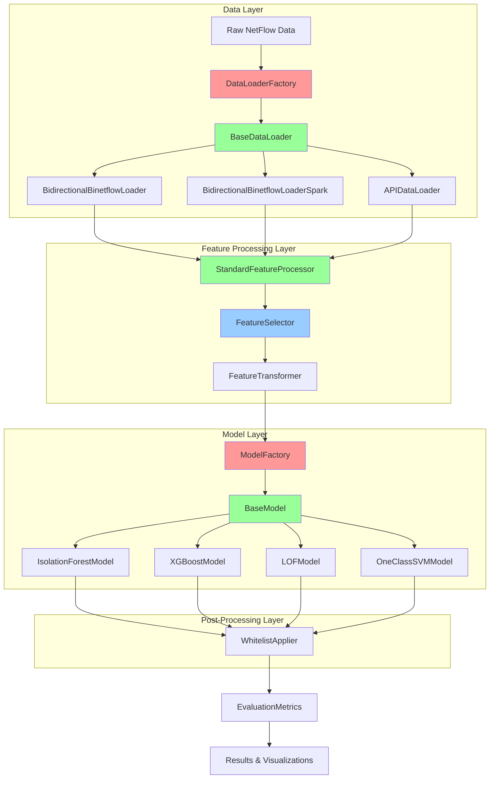
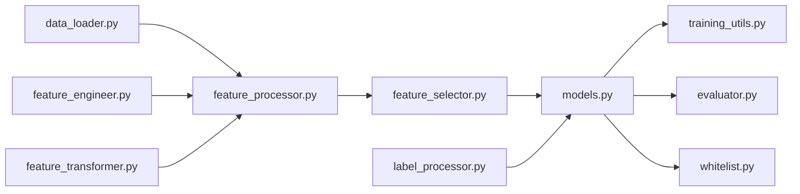
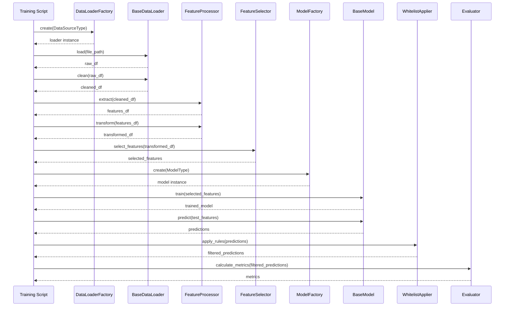

# 系統架構總覽

本文件提供 Network Anomaly Detection 專案的完整系統架構說明，重點展示設計模式的應用與模組間的關係。

**目標讀者**：技術主管、架構師、新進開發者

---

## 📋 目錄

1. [系統架構概覽](#系統架構概覽)
2. [設計模式應用位置](#設計模式應用位置)
3. [模組架構](#模組架構)
4. [資料流](#資料流)
5. [擴展性設計](#擴展性設計)

---

## 🏗 系統架構概覽

### 整體架構圖



**圖例說明**：
- 🔴 **紅色**：Factory Pattern 應用
- 🔵 **藍色**：Strategy Pattern 應用
- 🟢 **綠色**：Abstract Base Class Pattern 應用

---

## 🎯 設計模式應用位置

### 1. Factory Pattern

#### 應用位置 1：ModelFactory (`src/models.py`)

**目的**：統一創建不同類型的異常偵測模型

**類別層級**：
```
ModelFactory (工廠)
    ↓
BaseModel (抽象基類)
    ├── IsolationForestModel
    ├── XGBoostModel
    ├── LOFModel
    └── OneClassSVMModel
```

**使用場景**：
- 訓練腳本中動態選擇模型類型
- 基準測試中比較多種模型
- 未來擴展新模型類型

**檔案位置**：`src/models.py:1024-1120`

---

#### 應用位置 2：DataLoaderFactory (`src/data_loader.py`)

**目的**：統一不同資料來源的載入邏輯

**類別層級**：
```
DataLoaderFactory (工廠)
    ↓
BaseDataLoader (抽象基類)
    ├── BidirectionalBinetflowLoader
    ├── BidirectionalBinetflowLoaderSpark
    └── APIDataLoader
```

**使用場景**：
- 根據資料來源類型選擇載入器
- 支援本地檔案、Spark 分散式載入、API 載入
- 未來擴展新的資料來源

**檔案位置**：`src/data_loader.py:503-584`

---

### 2. Strategy Pattern

#### 應用位置：FeatureSelector (`src/feature_selector.py`)

**目的**：支援多種特徵選擇策略，可在執行時動態選擇

**類別層級**：
```
FeatureSelector (策略上下文)
    ↓
FeatureSelectionStrategy (枚舉)
    ├── QUALITY_CHECK
    ├── CORRELATION
    ├── IMPORTANCE
    └── ALL
```

**策略實作**：
- `_quality_check()` - 品質檢查策略
- `_correlation_analysis()` - 相關性分析策略
- `_importance_selection()` - 重要性選擇策略

**使用場景**：
- 根據資料特性選擇合適的特徵選擇策略
- 組合使用多種策略
- 未來新增新的選擇策略

**檔案位置**：`src/feature_selector.py:41-502`

---

### 3. Abstract Base Class Pattern

#### 應用位置 1：BaseModel (`src/models.py`)

**目的**：定義所有模型必須實作的統一介面

**抽象方法**：
- `train(X, y=None, **kwargs) -> Any`
- `predict(X) -> np.ndarray`

**實作類別**：
- `IsolationForestModel`
- `XGBoostModel`
- `LOFModel`
- `OneClassSVMModel`

**檔案位置**：`src/models.py:26-72`

---

#### 應用位置 2：BaseDataLoader (`src/data_loader.py`)

**目的**：定義所有資料載入器必須實作的統一介面

**抽象方法**：
- `load(file_path=None) -> pd.DataFrame`
- `clean(df) -> pd.DataFrame`
- `save_cleaned_data(df, output_path=None) -> Path`

**實作類別**：
- `BidirectionalBinetflowLoader`
- `BidirectionalBinetflowLoaderSpark`
- `APIDataLoader`

**檔案位置**：`src/data_loader.py:40-123`

---

#### 應用位置 3：BaseFeatureProcessor (`src/feature_processor.py`)

**目的**：定義所有特徵處理器必須實作的統一介面

**抽象方法**：
- `extract(df, **kwargs) -> pd.DataFrame`
- `transform(df, **kwargs) -> Tuple[pd.DataFrame, Any, List[str]]`
- `process(df, **kwargs) -> Tuple[pd.DataFrame, pd.DataFrame, Any, List[str]]`

**實作類別**：
- `StandardFeatureProcessor`

**檔案位置**：`src/feature_processor.py:27-311`

---

## 📦 模組架構

### 核心模組 (`src/`)

```
src/
├── models.py              # Factory Pattern: ModelFactory + BaseModel
├── data_loader.py         # Factory Pattern: DataLoaderFactory + BaseDataLoader
├── feature_selector.py    # Strategy Pattern: FeatureSelector
├── feature_processor.py   # Abstract Base Class: BaseFeatureProcessor
├── feature_engineer.py    # 特徵工程函數
├── feature_transformer.py # 特徵轉換函數
├── label_processor.py    # 標籤處理函數
├── training_utils.py     # 訓練工具函數
├── whitelist.py          # 白名單分析與應用
├── evaluator.py          # 評估指標計算
└── __init__.py           # 模組匯出
```

### 模組依賴關係



---

## 🔄 資料流

### 完整 Pipeline



---

## 🔧 擴展性設計

### 擴展點 1：新增模型類型

**步驟**：
1. 在 `ModelType` 枚舉中新增類型
2. 建立新模型類別，繼承 `BaseModel`
3. 實作 `train()` 和 `predict()` 方法
4. 在 `ModelFactory._models` 中註冊

**範例**：
```python
# 1. 新增枚舉
class ModelType(Enum):
    NEW_MODEL = "new_model"

# 2. 實作模型類別
class NewModel(BaseModel):
    def train(self, X, y=None, **kwargs):
        # 實作訓練邏輯
        pass
    
    def predict(self, X):
        # 實作預測邏輯
        pass

# 3. 註冊到工廠
ModelFactory._models[ModelType.NEW_MODEL] = NewModel
```

**優勢**：
- ✅ 無需修改現有程式碼
- ✅ 自動獲得 Factory Pattern 支援
- ✅ 統一介面保證一致性

---

### 擴展點 2：新增資料來源

**步驟**：
1. 在 `DataSourceType` 枚舉中新增類型
2. 建立新載入器類別，繼承 `BaseDataLoader`
3. 實作 `load()` 和 `clean()` 方法
4. 在 `DataLoaderFactory._loaders` 中註冊

**優勢**：
- ✅ 無需修改現有程式碼
- ✅ 自動獲得 Factory Pattern 支援
- ✅ 統一介面保證一致性

---

### 擴展點 3：新增特徵選擇策略

**步驟**：
1. 在 `FeatureSelectionStrategy` 枚舉中新增策略
2. 在 `FeatureSelector` 中實作對應的私有方法
3. 在 `select_features()` 方法中加入策略判斷邏輯

**優勢**：
- ✅ 策略模式支援動態選擇
- ✅ 可組合使用多種策略
- ✅ 單一職責原則

---

## 📊 模組職責劃分

| 模組 | 職責 | 設計模式 | 依賴 |
|------|------|---------|------|
| `models.py` | 模型定義與工廠 | Factory + ABC | - |
| `data_loader.py` | 資料載入與工廠 | Factory + ABC | - |
| `feature_processor.py` | 特徵處理管道 | ABC | `feature_engineer.py`, `feature_transformer.py` |
| `feature_selector.py` | 特徵選擇策略 | Strategy | - |
| `training_utils.py` | 訓練工具函數 | - | `models.py` |
| `whitelist.py` | 白名單分析與應用 | - | - |
| `evaluator.py` | 評估指標計算 | - | - |

---

## 🎨 設計原則遵循

### SOLID 原則

1. **單一職責原則 (SRP)**
   - ✅ `FeatureSelector` 專門負責特徵選擇
   - ✅ `ModelFactory` 專門負責模型創建
   - ✅ `DataLoaderFactory` 專門負責載入器創建

2. **開放封閉原則 (OCP)**
   - ✅ 透過 Factory Pattern 擴展新模型類型
   - ✅ 透過 Strategy Pattern 擴展新選擇策略
   - ✅ 無需修改現有程式碼即可擴展

3. **里氏替換原則 (LSP)**
   - ✅ 所有 `BaseModel` 子類別可互相替換
   - ✅ 所有 `BaseDataLoader` 子類別可互相替換

4. **介面隔離原則 (ISP)**
   - ✅ `BaseModel` 定義最小必要介面
   - ✅ `BaseDataLoader` 定義最小必要介面

5. **依賴倒置原則 (DIP)**
   - ✅ 高層模組依賴抽象（`BaseModel`, `BaseDataLoader`）
   - ✅ 低層模組實作抽象介面

---

## 🔗 相關文檔

- [設計模式總覽](DESIGN_PATTERNS.md) - 詳細的設計模式說明
- [Isolation Forest 改進計劃](ISOLATION_FOREST_IMPROVEMENT_PLAN.md) - 模型改進追蹤
- [XGBoost 過擬合檢查](XGBOOST_OVERFITTING_CHECK.md) - 過擬合檢測功能

---

## 📅 更新記錄

| 日期 | 更新內容 | 更新人 |
|------|---------|--------|
| 2024-12-XX | 建立系統架構文檔 | - |

